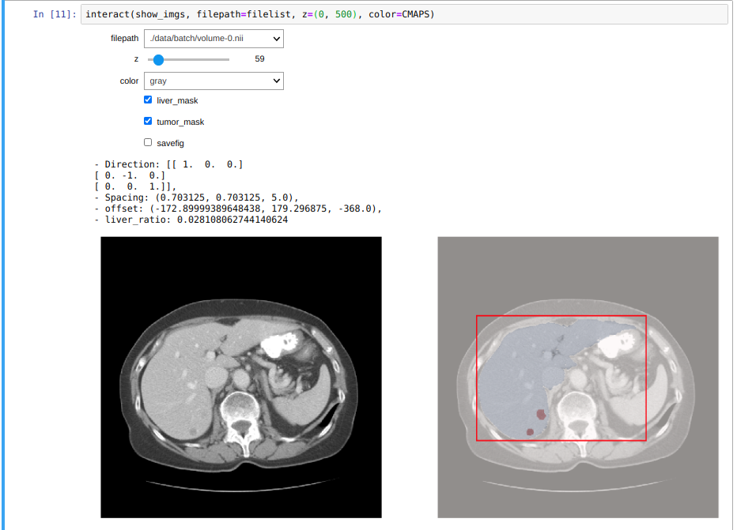
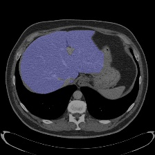
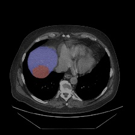
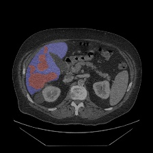

# LiTS-liver-and-lesion-segmentation-toolbox

This Toolbox is designed for the research purpose only. 

## Environment setup

We have developed our Toolbox with pytorch under python=3.6 and tested for both CUDA 10.0/10.2.

Build virtual environment:

      $ conda create --name <envname> --file requirements.txt

If you want to install packages manually, here is the list (pip install -)

- medpy (read medical image)
- nibabel (read medical image)
- tqdm
- opencv-python
- h5py
- pytorch, torchvision (please see the offical site for installation details)
- torchsummary

## Usage

Under the root folder:

- Put the unzipped dataset downloaded from the site to the folder ./data. Our pre-processing can find the \*.nii file recursively.

### Interactive jupyter widgets for dataset visualization

- run the jupyter notebook: visualize_imgs.ipynb

### Data pre-processing

- The train/valid set will be saved into two hdf5 files separately with name train\_LiTS\_db.h5 and valid\_LiTS\_db.h5 

      $ python ./src/preprocessing/preprocessing.py -dir "./data" --save2file "./data/LiTS_db.h5" --valid-split 0.2

- If you want to resize the volumes (per z-slice)

      $ python ./src/preprocessing/preprocessing.py -dir "./data" --save2file "./data/LiTS_db_224.h5" --img-shape "(224,224)"

- For the test set (without segmentation mask): the file name will be test\_LiTS\_db.h5

      $ python ./src/preprocessing/preprocessing.py -dir "./data" --save2file "./data/LiTS_db.h5" --test-set
	

- Interactively visualize dataloader (with data augmentation)
      $ python ./src/preprocessing/dataloader.py -f ./data/train_LiTS_db_224.h5

### Training

- From scratch:

      $ python ./src/train.py --epochs 50 -lr 0.00005 --log-dir "./weights/Exp_000" -trainf "./data/train_LiTS_db.h5" -validf "./data/valid_LiTS_db.h5" --batch-size 32  --num-cpu 32 --shuffle --cuda 0

- Load pretrained weights or model

      $ python ./src/train.py --epochs 50 -lr 0.00005 --log-dir "./weights/Exp_000" -trainf "./data/train_LiTS_db.h5" -validf "./data/valid_LiTS_db.h5" --batch-size 32  --num-cpu 32 --shuffle --cuda 0 --load-weights "./weights/model_weights.pth"

### Inference and evaluation

Note that we can either load pretrained weights (`model.state_dict()`) by --load-weights or the entire model by --load-model

- Evaluation mode

      $ python ./src/inference.py **-eval** --batch-size 32 --num-cpu 32 -testf ./data/valid_LiTS_db_224.h5 --load-weights "./weights/Exp_000/model_weights.pth" --save2dir ./results/Exp_000

- Inference mode

      $ python ./src/inference.py --batch-size 32 --num-cpu 32 -testf ./data/test_LiTS_db_224.h5 --load-model "./weights/Exp_000/model.pth" --save2dir ./results/Exp_000

### Submission

